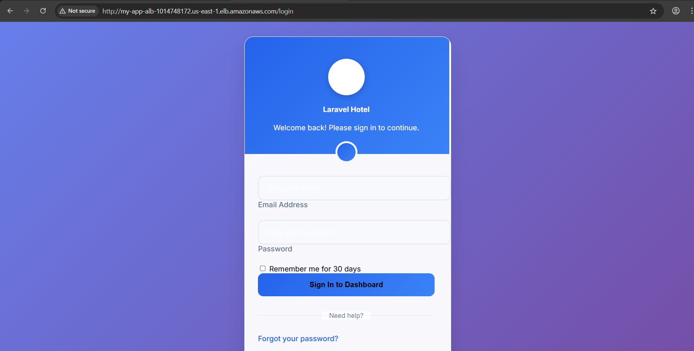
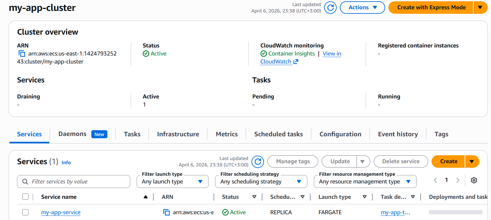
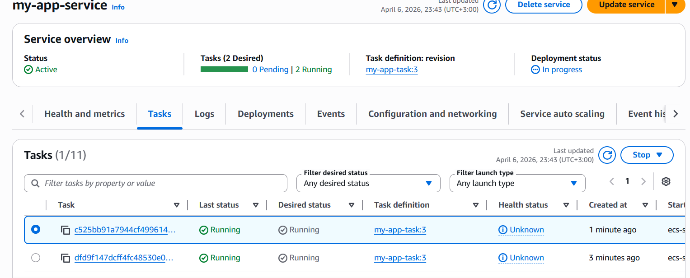
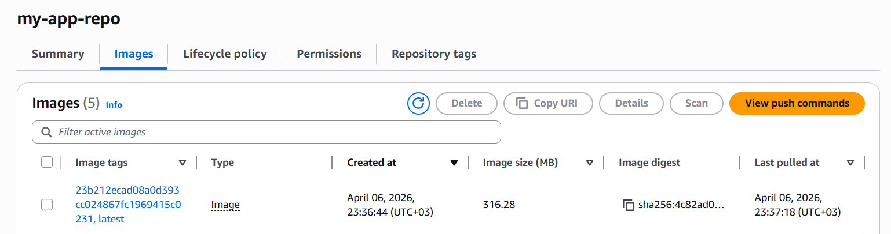
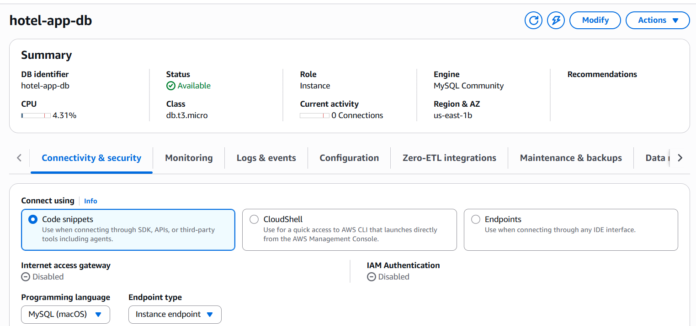
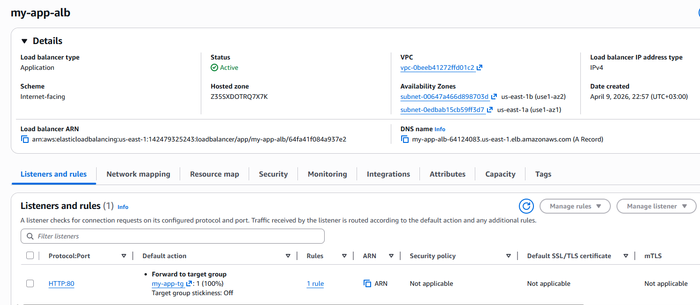

# 🏨 StayStack — Cloud-Native Hotel Booking Platform

> A production-grade Laravel hotel booking application deployed on AWS using ECS Fargate, powered by Terraform (IaC) and GitHub Actions (CI/CD).



---

## 🚀 Project Highlights

- 🔥 Cloud-native architecture on AWS (ECS Fargate)
- ⚙️ Infrastructure as Code with modular Terraform design
- 🔁 Fully automated CI/CD pipeline using GitHub Actions
- 🔐 Secure secrets management via AWS Secrets Manager
- 🌍 Highly available across multiple Availability Zones
- 📦 Dockerized Laravel application with versioned images

---

## 🧠 Architecture Overview

```
                        ┌─────────────────────────────────────────┐
                        │             AWS Cloud                   │
                        │                                         │
         Internet ────► │   Application Load Balancer (ALB)       │
                        │        (Public Subnets)                 │
                        │               │                         │
                        │               ▼                         │
                        │     ECS Fargate Tasks (Private)         │
                        │        ├── Task (AZ-1)                  │
                        │        └── Task (AZ-2)                  │
                        │               │                         │
                        │               ▼                         │
                        │        RDS MySQL (Private)              │
                        └─────────────────────────────────────────┘
```

---

## 🧩 Tech Stack

| Layer            | Technology |
|------------------|-----------|
| Backend          | Laravel (PHP) |
| Containerization | Docker |
| Orchestration    | AWS ECS Fargate |
| Registry         | Amazon ECR |
| Database         | Amazon RDS (MySQL 8.0) |
| Load Balancing   | Application Load Balancer |
| IaC              | Terraform |
| CI/CD            | GitHub Actions |
| Monitoring       | CloudWatch |
| Secrets          | AWS Secrets Manager |

---

## 🏗️ Infrastructure Design

```
infrastructure/
├── root/
│   ├── main.tf
│   ├── variables.tf
│   ├── outputs.tf
│   └── terraform.tfvars (ignored)
└── modules/
    ├── networking/
    ├── security/
    ├── rds/
    ├── ecr/
    ├── iam/
    ├── alb/
    ├── ecs/
    └── secrets/
```

---

## 🔐 Security Architecture

```
Internet
   ↓
ALB (Port 80 only)
   ↓
ECS Tasks (Private Subnets)
   ↓
RDS (Restricted Access)
```

- No credentials stored in code or Terraform state
- Secrets managed via AWS Secrets Manager
- ECS tasks run without public IPs
- Strict Security Groups between layers
- Sensitive files excluded via `.gitignore`

---

## 🔄 CI/CD Pipeline

### ✅ Pull Request (PR → main)
- Run PHP tests
- Use MySQL service container
- Validate application integrity

### 🚀 Push to Main Branch

```
Test → Build → Push Image → Deploy → Migrate → Done ✅
```

- Run automated tests
- Build Docker image
- Push to ECR (tagged with commit SHA + latest)
- Deploy via ECS rolling update
- Wait for service stability
- Run migrations & seeders

---

## ⚡ Getting Started

### 1. Clone Repository

```bash
git clone https://github.com/your-username/staystack.git
cd staystack
```

---

### 2. Configure Terraform

```bash
cd infrastructure/root
cp terraform.tfvars.example terraform.tfvars
```

Update values:

```hcl
app_key     = "base64:your-laravel-key"
db_username = "your-db-user"
db_password = "your-secure-password"
```

---

### 3. Deploy Infrastructure

```bash
terraform init
terraform plan
terraform apply
```

Example output:

```
alb_dns_name = my-app-alb-xxxx.elb.amazonaws.com
```

---

### 4. Configure GitHub Secrets

Go to:

`Repository → Settings → Secrets → Actions`

Add:

| Key | Value |
|-----|------|
| AWS_ACCESS_KEY_ID | Your AWS Access Key |
| AWS_SECRET_ACCESS_KEY | Your AWS Secret Key |

---

### 5. Deploy Application

```bash
git push origin main
```

The pipeline will automatically:
- Test
- Build
- Deploy

---

## 📸 Screenshots

### 🖥️ Application


### ⚙️ ECS Cluster


### 🔄 ECS Service


### 📦 ECR Images


### 🗄️ RDS Instance


### 🌐 Load Balancer


---

## 🎯 Key Takeaways

- Real-world cloud deployment using best practices
- Clean modular Terraform structure
- Secure and scalable architecture
- Fully automated CI/CD pipeline
- Production-ready design

---

## 👨‍💻 Author

Developed as a hands-on cloud engineering project to demonstrate:
- AWS architecture skills
- DevOps practices
- Infrastructure automation

---

## ⭐ Support

If you like this project, give it a ⭐ on GitHub!
